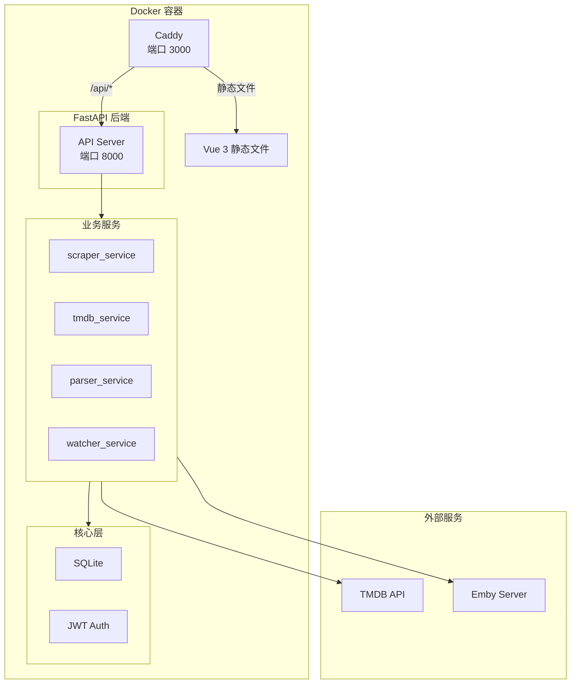

# MHTI

MHTI - 自动从 TMDB 获取剧集信息并整理媒体文件。

## 项目概览

全栈 Web 应用，包含 Python 后端 API 和 Vue.js 前端，专为 Docker/Linux 环境优化部署。

### 核心功能

- 视频文件名解析（支持多种命名格式）
- TMDB 元数据搜索与获取
- NFO 文件生成（Emby/Jellyfin 兼容）
- 文件整理（复制/移动/硬链接/软链接）
- 图片下载（海报、背景图、剧集缩略图）
- 字幕文件关联处理
- 文件夹监控与自动刮削
- Emby 媒体库冲突检测

## 架构图



## 模块索引

| 模块 | 路径 | 说明 |
|------|------|------|
| server | `server/` | Python 后端 |
| web | `web/` | Vue.js 前端 |

## 技术栈

### 后端
- Python 3.11+
- FastAPI + Uvicorn
- aiosqlite (异步 SQLite)
- httpx (HTTP 客户端)
- watchdog (文件监控)
- python-jose (JWT)

### 前端
- Vue 3.5 + TypeScript 5.9
- Vite 7
- Pinia (状态管理)
- Naive UI (组件库)
- Vue Router 4
- Axios

### 部署
- Docker (多阶段构建)
- Caddy (反向代理 + 静态文件服务)
- Linux (推荐)

## 快速开始

### Docker 部署 (推荐)

```bash
# 启动服务
docker-compose up -d

# 查看日志
docker-compose logs -f

# 访问应用
# http://localhost:3000
# API 文档: http://localhost:3000/api/docs
```

### 开发模式

```bash
# 后端 API (端口 8000)
python run_server.py                    # 启动 API 服务器
python run_server.py --host 0.0.0.0     # 局域网访问
pytest                                   # 运行测试

# 前端开发 (端口 3000)
cd web
npm install                             # 安装依赖
npm run dev                             # 开发服务器
npm run build                           # 构建
```

## Docker 配置

配置直接在 `docker-compose.yml` 中修改：

```yaml
ports:
  - "3000:3000"   # 主入口 (Caddy)
  - "8000:8000"   # API 直接访问 (可选)

environment:
  - TZ=Asia/Shanghai  # 时区
```

### 卷挂载示例

```yaml
volumes:
  - ./data:/app/data           # 数据持久化
  - /media/movies:/media:ro    # 媒体库（只读）
  - /output:/output            # 输出目录
```

## 数据存储

- 数据库: `data/scraper.db` (SQLite)
- 配置加密: AES-256-GCM

## API 端点

| 路径 | 说明 |
|------|------|
| `/api/auth/*` | 认证 |
| `/api/files/*` | 文件浏览 |
| `/api/scraper/*` | 刮削操作 |
| `/api/config/*` | 配置管理 |
| `/api/watcher/*` | 文件夹监控 |
| `/api/tmdb/*` | TMDB 代理 |
| `/api/emby/*` | Emby 集成 |
| `/ws` | WebSocket |
| `/health` | 健康检查 |

## 全局规范

### 代码风格
- Python: Ruff + Black (line-length=100)
- TypeScript: ESLint + Prettier
- 类型注解: 严格模式

### 命名约定
- Python: snake_case
- TypeScript: camelCase
- 组件: PascalCase

### 提交规范
- feat: 新功能
- fix: 修复
- docs: 文档
- refactor: 重构

## 建议深挖路径

1. `server/services/parsers/` - 文件名解析器实现
2. `server/services/scrape_job_service.py` - 刮削任务队列
3. `web/src/composables/` - Vue 组合式函数
4. `server/tests/` - 测试用例参考
